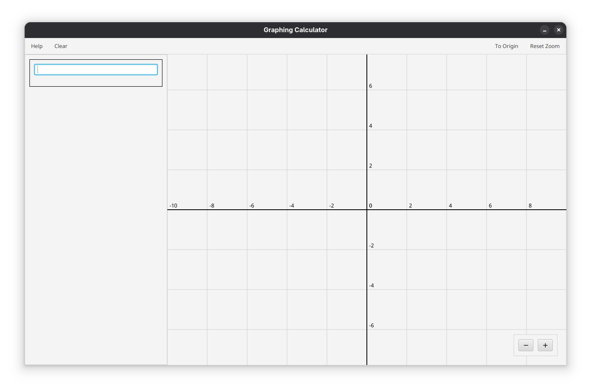
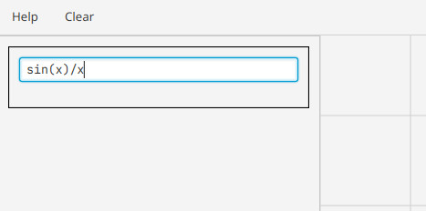
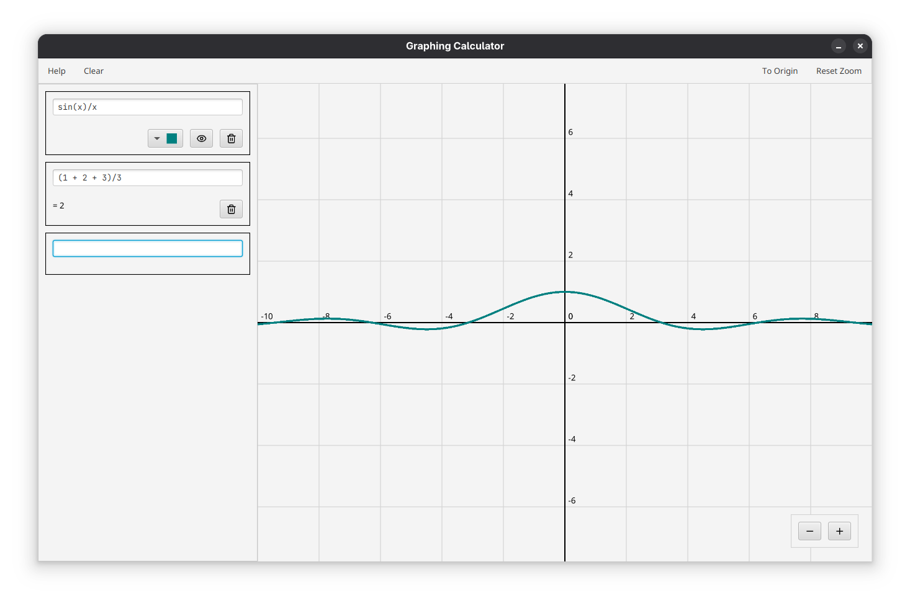
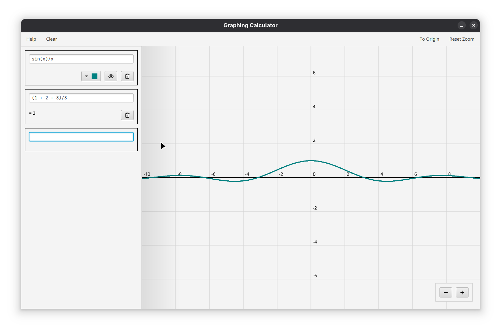
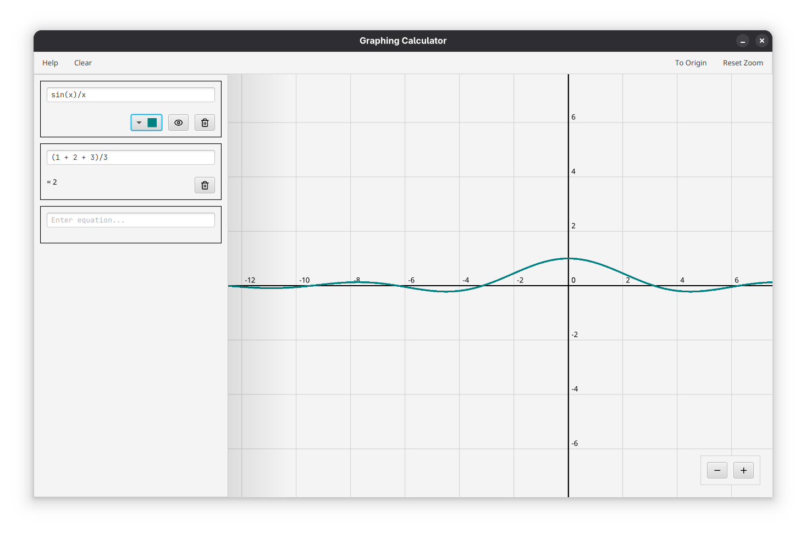
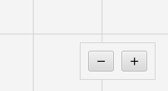
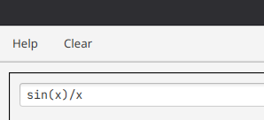
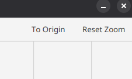
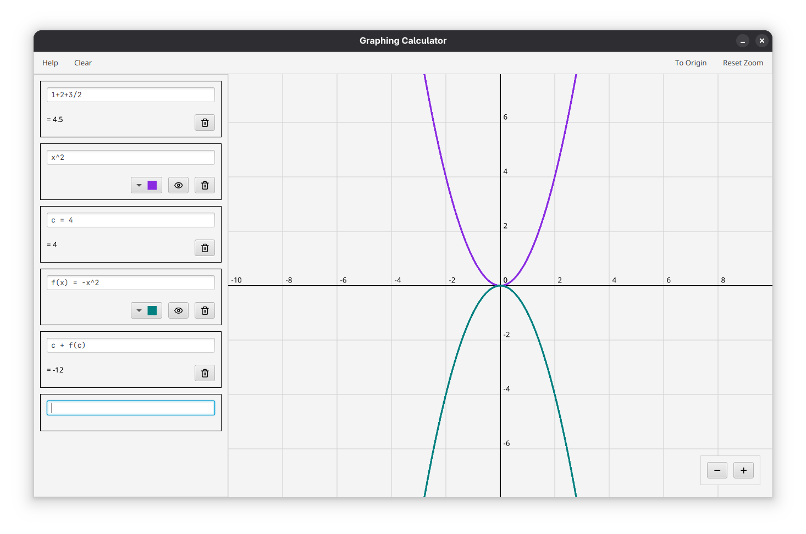

# Graphing Calculator

## Introduction

This is a **Graphing Calculator** designed for evaluating mathematical expressions, plotting equations, and defining custom constants and functions within an intuitive user interface. The calculator is built to support a wide range of mathematical operations including trigonometric, logarithmic, and algebraic expressions. Users can input equations and immediately visualize them, define reusable identifiers, and interact dynamically with the graph through panning and zooming.

The calculator supports four input modes: expression evaluation, graphing, constant definition, and function definition. It also offers useful graph customization features, such as changing line colors and toggling visibility.

This project was developed as part of the *Programming Methodology* course project submission at *Chulalongkorn University*.

## How to Use

### User Interface

This is the UI of the graphing calculator:


To add an equation, type the equation into the text box on the left panel then hit enter.



After hitting enter, if the equation is graphable (that is, is a function or contains the variable `x`), the graph and graph options which include color, visibility, and delete will appear. If the equation is evaluation (that is, can be evaluated to a produce a result), a result field will appear below the input box:



As the icon suggests, the color button lets the user change the color of the graph, the visibility (eye icon) toggles the graph's visibility, and the delete (trash button) deletes the graph and equation.

To move to different areas of the plane, hover the the mouse over one side of the graphing area. A dark region will appear and clicking on that region will pan the graph in that direction.

- Before clicking: 
- After clicking: 

To zoom in and out, click the + or - button on the bottom right side of the window.



Taking a look at the top bar, there are 'Help' and 'Clear' button on the top left side. Pressing 'Clear' deletes all equations and graphs and pressing 'Help' shows a pop up of a brief guide of the calculator.



And on the right, you can reset the position of the graph by pressing 'To Origin' and reset zoom by pressing 'Reset Zoom'.



### Input Modes

There are four ways to use the calculator:

1. **Evaluation**  
   Input a standard expression, like:  
   
   ```
   4 + sin(pi)
   ```
   The calculator will show the evaluated result.
   
2. **Graphing**  
   Input an expression with variable `x`, like:  
   
   ```
   x^2 + 3x + 2
   ```
   The graph is plotted in the right-hand panel.
   
3. **Constant Definition**  
   Define a constant using `<constant name> =`, like:  
   
   ```
   a = 5 + pi
   ```
   Now `a` can be used in other expressions.
   
4. **Function Definition**  
   Define a function using `<function name>(x) =`, like: 
   
   ```
   f(x) = sin(x) + x^2
   ```
   This function will be graphable and usable in other expressions.

Example of using the 4 input modes, and the constant and function definitions:



> [!NOTE]
>
> The identifiers (string that defines the function and constant) are case-sensitive and can consist of multiple characters. Any sequence of characters uninterrupted by whitespace is treated as a single identifier.

## Features

### Expressions

Full parsing for most valid non-ambiguous human input expressions, that are using the following supported symbols:

```
+, -, *, /, %, ^, (, )
```

with special case handling for: 

- Implicit multiplication: `"(x + 3)(x + 2)"`.
- Function powers like `"sin^2 x"`.
- Precidence of function order with and without parentheses. e.g., `"sin(x)^2"` handles sine first, whereas `"sin x^2"` handles squaring first.

> [!NOTE]
>
> Some things to consider:
>
>  - Use `"abs(x)"` for absolute values, and `"fact(x)"` for factorial. `|` and `!` are not supported.
>  - Usual inverse function notation like `"sin^-1(x)"` means the reciprocal. Use `arc` prefix for inverse trigonometric functions insetead. 

### Identifiers

These are the list of included identifiers:

#### Built-in Constants

- `e`  – Euler’s number (~2.718)
- `pi` – π (~3.14159)

#### Built-in Functions

- Trigonometric: `sin`, `cos`, `tan`, `sec`, `csc`, `cot`, `arcsin`, `arccos`, `arctan`
- Other: `abs`, `exp`, `log`, `ln`, `sqrt`, `cbrt`, `floor`, `ceil`, `fact`

#### **Custom Identifiers**

- As stated above, users can define constants and functions (e.g., `"g = 9.8"`, and `"f(x) = x^2 + sin(x)"`) to use in other calculations, graphs, or even other identifier definitions.

### Graphs

- Support for graphing any equations supported by the equation parsing above. Including asymptotic function handling, discontinuities, and more.

- Support customizing each graph, disabling graphs, and panning and zooming on the graph pane.

### **Other QoL Improvements**  
- Invalid identifier check (non-recursive): Checks and notifies user of equations with undefined identifiers.
- Recursion check: Prevents infinite recursion by detecting self-referencing definitions.

## Project Class Diagram


# Code Documentation

## Package `parser`

Provides code for converting human math expressions into tokens, and finally, parses those tokens into abstract syntax tree (AST) of expression nodes that are computer readable.

### Enumeration `TokenType`

Provides the types of acceptable tokens from user input. 

| **Enumeration** | **Explanation**                                       |
| ------------- | --------------------------------------------------------------- |
| `NUMBER`      | A numeric value (e.g., `3.14`, `42`).                           |
| `IDENTIFIER`  | A string; can represent both a literal and a function (e.g., `x`, `sin`). |
| `PLUS`        | The plus operator (`+`).                                       |
| `MINUS`       | The minus operator (`-`).                                       |
| `MULTIPLY`    | The multiplication operator (`*`).                              |
| `DIVIDE`      | The division operator (`/`).                                    |
| `MODULO`      | The modulo operator (`%`).                                      |
| `POWER`       | The exponentiation operator (`^`).                              |
| `LPAREN`      | Left parenthesis (`(`).                                        |
| `RPAREN`      | Right parenthesis (`)`).                                        |
| `EQUAL`       | The equals sign (`=`), used in assignment or equations.         |
| `END`         | End of input token, used to mark expression completion. |


### Class `Token`

Token object for tokenizing and parsing.

| **Field**          | **Explanation**                                                                                                            |
| ------------------ | -------------------------------------------------------------------------------------------------------------------------- |
| `+ TokenType type` | The type of the token.                                                                                                     |
| `+ String text`    | The string representation of the token. If the token type is `IDENTIFIER` or `NUMBER`, this also stores the token's value. |

| **Method**                             | **Explanation**                                  |
| -------------------------------------- | ------------------------------------------------ |
| `+ Token(TokenType type, String text)` | Constructor that sets the token's type and text. |
| `+ String toString()`                  | Returns the token’s text.                        |

### Class `Lexer`

Provides functionality to convert a string of human-readable mathematical expressions into a list of `Token` objects. It classifies characters into identifiers, numbers, or symbolic operators and validates input during the process. Throws a `LexerException` if an invalid character or malformed number is encountered.

| **Field**              | **Explanation**                                      |
|------------------------|------------------------------------------------------|
| `- String identifiable`| Characters allowed in identifiers.                  |
| `- String numerable`   | Characters allowed in numbers (digits and decimal). |
| `- Map<Character, TokenType> tokenMap` | Mapping from single characters to predefined token types. |

| **Method**                                 | **Explanation**                                              |
| ------------------------------------------ | ------------------------------------------------------------ |
| `+ List<Token> tokenize(String input)`     | Static method that converts the input string into a list of `Token` objects. Throws `LexerException` on error. |
| `- boolean isIdentifiable(char character)` | Returns `true` if the character is a valid identifier character. |
| `- boolean isNumerable(char character)`    | Returns `true` if the character is a valid numeric character. |

### Class `Parser`

Converts a list of `Token`s into an AST of `Expression`s. It handles operator precedence, parenthesis grouping, function calls, and implicit multiplication. This parser follows a recursive descent strategy with different levels for addition, multiplication, exponentiation, and base expressions. Throws a `ParserException` when encountering syntax errors.

The parser (roughly) implements the following grammar:

- `a` (addition) → `m` ( (`+`|`-`) `m` )*,
- `m` (multiplication) → `p` ( ( (`*`|`/`) `p` )* | `p` ) ,
  - *Note: the final `p` will only parse if it is `implicitMultipliable`*.
- `p` (power) → `b` (`^p`)?,
- `b` (base) → `(a)` | `f` | `NUM` | `LIT` | `-p`,
- `f` (function) → `FUNC` (`^p`)? ( `p` | `(a)` ),

where `NUM` is a number, `LIT` is a literal identifier, and `FUNC` is a function identifier.

| **Field**                            | **Explanation**                                            |
| ------------------------------------ | ---------------------------------------------------------- |
| `- SymbolManager symbolManager`      | Used to construct literals and functions from identifiers. |
| `- List<Token> implicitMultipliable` | Tokens that can be implicitly multiplied when juxtaposed.  |
| `- List<Token> tokens`               | List of input tokens to be parsed.                         |
| `- Expression headExpression`        | Final parsed expression (AST root node).                   |
| `- int current`                      | Current index in the token list.                           |

| **Method**                                    | **Explanation**                                              |
| --------------------------------------------- | ------------------------------------------------------------ |
| `+ Parser(List<Token> tokens, SymbolManager)` | Constructor that initializes the parser with token list and symbol manager. |
| `+ void parse()`                              | Parses the token list and constructs the AST, storing it in `headExpression`. Throws `ParserException` on error. (*Note: each of the parse methods below all throw `ParserException` but is omitted.*) |
| `- Expression parseAddition()`                | Parses expressions involving `+` and `-`, lowest precedence. |
| `- Expression parseMultiplication()`          | Parses `*`, `/`, `%`, and implicit multiplication.           |
| `- Expression parsePower()`                   | Parses exponentiation `^`.                                   |
| `- Expression parseBase()`                    | Parses numbers, identifiers, parenthesis groups, and functions. |
| `- Expression parseFunction()`                | Parses functions with optional exponentiation and parentheses. |
| `- void advance()`                            | Moves to the next token.                                     |
| `- Token currentToken()`                      | Returns the current token being parsed.                      |
| `- boolean canImplicitMultiply(Token token)`  | Returns `true` if a token allows implicit multiplication.    |
| `+ Expression getHeadExpression()`            | Getter for `headExpression`.                                 |

## Package `parser.exception`

Exceptions for parsing processes.

### Class `LexerException`

*extends `Exception`*

A custom exception class thrown during tokenization phase when an invalid character or malformed token is encountered.

| **Constructor**                   | **Explanation**                                          |
|----------------------------------|----------------------------------------------------------|
| `+ LexerException()`             | Default constructor with a generic error message.        |
| `+ LexerException(String message)` | Constructor with a custom error message.                 |

### Class `ParserException`

*extends `Exception`*

A custom exception class thrown during the parsing phase when an expression does not follow the grammatical syntax.

| **Constructor**                   | **Explanation**                                          |
|----------------------------------|----------------------------------------------------------|
| `+ ParserException()`        | Default constructor with a generic error message.        |
| `+ ParserException(String message)` | Constructor with a custom error message.                 |

## Package `expression.base`

Base types for expression AST nodes.

### Abstract Class `Expression`

AST expression base node. Defines the methods for all expression types that can be evaluated to a `double` value using the symbol table in a given `SymbolManager`.

| **Field**            | **Explanation**                                                             |
|----------------------|------------------------------------------------------------------------------|
| `+ Expression NULL` | Static null `Expression` object used as a placeholder or error fallback. |

| **Method**                                   | **Explanation**                                              |
| -------------------------------------------- | ------------------------------------------------------------ |
| `+ double eval(SymbolManager symbolManager)` | Abstract method that defines the evaluation of the expression without an external variable. |
| `+ double eval(double x, SymbolManager)`     | Abstract method that defines the evaluation of the expression with `x` as a variable input. |

### Abstract Class `UnaryExpression`

*extends `Expression`*

An abstract base class for unary expressions. Encapsulates the logic for evaluating a single sub-expression (`arg`) with a given unary operator using the `operate` method.

| **Field**          | **Explanation**                                              |
| ------------------ | ------------------------------------------------------------ |
| `# String symbol`  | Symbol representing the unary operation (e.g., `"sin"`, `"arctan"`). |
| `# Expression arg` | The expression on which the unary operation is applied.      |

| **Method**                                                | **Explanation**                                              |
| --------------------------------------------------------- | ------------------------------------------------------------ |
| `# UnaryExpression(Expression arg, String symbol)`        | Constructor that sets the argument expression `arg`, and a `symbol`, which is the string representation of the operation. |
| `# double operate(double a, SymbolManager symbolManager)` | Abstract method that defines the unary operation to be implemented by subclasses. |
| `+ double eval(SymbolManager symbolManager)`              | Evaluates the whole expression by using `operate` on the result of the argument. |
| `+ double eval(double x, SymbolManager symbolManager) `   | Evaluates the whole expression by using `operate` on the result of the argument with a variable `x`. |
| `+ String toString()`                                     | Returns string in the format `"<symbol>(<arg>)"`.            |

### Abstract Class `BinaryExpression`

*extends `Expression`*

An abstract base class for binary expressions. Encapsulates the logic for evaluating a two sub-expressions (`left` and `right`) with a given binary operator using the `operate` method.

| **Field**                           | **Explanation**                                                                  |
|-------------------------------------|----------------------------------------------------------------------------------|
| `# String symbol`                   | Symbol representing the binary operation (e.g., `"+"`, `"*"`, `"^"`).           |
| `# Expression left`                 | The left operand of the binary expression.                                      |
| `# Expression right`                | The right operand of the binary expression.                                     |

| **Method**                                                   | **Explanation**                                              |
| ------------------------------------------------------------ | ------------------------------------------------------------ |
| `# BinaryExpression(Expression left, Expression right, String symbol)` | Constructor that sets the argument expressions, `left` and `right`, and a `symbol`, which is the string representation of the operation. |
| `# double operate(double a, double b)`                       | Abstract method that defines the binary operation to be implemented by subclasses. |
| `+ double eval(SymbolManager symbolManager)`                 | Evaluates the whole expression by using `operate` on the results of the operands. |
| `+ double eval(double x, SymbolManager symbolManager)`       | Evaluates the whole expression by using `operate` on the results of the operands using the variable `x`. |
| `+ String toString()`                                        | Returns string in the format `"(<left> <symbol> <right>)"`.  |

## Package `expression.literals`

Contains AST nodes for literal expressions, which represent fixed values in an expression.

### Class `Constant`

*extends `Expression`*

Represents a fixed numerical value in an expression. Always evaluates to the same value regardless of input.

| **Field**                    | **Explanation**                                                          |
|------------------------------|--------------------------------------------------------------------------|
| `- double value`             | The constant numerical value.                                           |
| `- String name`              | Optional name to use when displaying the constant (can be `null`).      |

| **Method**                                             | **Explanation**                                              |
| ------------------------------------------------------ | ------------------------------------------------------------ |
| `+ Constant(double value)`                             | Constructor for a constant with only a numerical value.      |
| `+ Constant(double value, String name)`                | Constructor for a constant with both a value and a display name. |
| `+ double eval(SymbolManager symbolManager)`           | Returns the stored constant value.                           |
| `+ double eval(double x, SymbolManager symbolManager)` | Returns the stored constant value.                           |
| `+ String toString()`                                  | Returns the name if present; otherwise, returns the string form of the value. |

### Class `Variable`

*extends `Expression`*

Represents a variable `x` in an expression.

| **Method**                                             | **Explanation**             |
| ------------------------------------------------------ | --------------------------- |
| `+ Variable()`                                         | Constructor for a variable. |
| `+ double eval(SymbolManager symbolManager)`           | Returns `NaN`.              |
| `+ double eval(double x, SymbolManager symbolManager)` | Returns the value of `x`.   |
| `+ String toString()`                                  | Returns the string `"x"`.   |

### Class `UserConstant`

*extends `Expression`*

Represents a user-defined constant by referencing its identifier.

| **Field**                   | **Explanation**                                                        |
|-----------------------------|------------------------------------------------------------------------|
| `- String identifier`       | The name of the user-defined constant used to retrieve its expression. |

| **Method**                                             | **Explanation**                                              |
| ------------------------------------------------------ | ------------------------------------------------------------ |
| `+ UserConstant(String identifier)`                    | Constructs a user constant with the given identifier.        |
| `+ double eval(SymbolManager symbolManager)`           | Retrieves and evaluates the constant expression from `SymbolManager`. |
| `+ double eval(double x, SymbolManager symbolManager)` | Retrieves and evaluates the constant expression from `SymbolManager`. |

## Package `expression.functions`

Contains AST nodes for general mathematical functions. Each class extends UnaryExpression and shares a common structure: a constructor and an operate method that overrides the abstract method to perform the corresponding mathematical computation. So for brevity, the list of methods and their explanations is omitted for most of the classes, and `x` refers to the argument in the `operate` method.

### Class `Absolute`

*extends `UnaryExpression`*

The absolute value function ($|\cdot|$); returns `-x` if `x` is less than `0`, otherwise, returns `x`.

### Class `Floor`

*extends `UnaryExpression`*

The floor function ($\lfloor\cdot\rfloor$); returns the greatest integer less than or equal to `x`.

### Class `Ceiling`

*extends `UnaryExpression`*

The ceiling function ($\lceil\cdot\rceil$); returns the smallest integet greater than or equal to `x`.

### Class `SquareRoot`

*extends `UnaryExpression`*

The squre root function ($\sqrt{\cdot}$); returns the number whose square is `x`.

### Class `CubeRoot`

*extends `UnaryExpression`*

The cube root function ($\sqrt[3]{\cdot}$); returns the number whose cube is `x`.

### Class `Exponential`

*extends `UnaryExpression`*

The exponential function ($\exp(\cdot)$); returns $e^\mathsf{x}$.

### Class `Logarithm`

*extends `UnaryExpression`*

The logarithm function ($\log(\cdot)$); returns the number whose exponential is `x`.

### Class `Factorial`

*extends `UnaryExpression`*

The integer factorial ($\,\cdot\ !$); returns the product of all positive integers not exceeding `x`, or returns `NaN` if `x` is not a non-negative integer.

### Class `UserFunction`

*extends `UnaryExpression`*

Represents a user-defined function by referencing its identifier.

| **Field**             | **Explanation**                                              |
| --------------------- | ------------------------------------------------------------ |
| `- String identifier` | The name of the user-defined function used to retrieve its expression. |

| **Method**                                                | **Explanation**                                              |
| --------------------------------------------------------- | ------------------------------------------------------------ |
| `+ UserFunction(String identifier, Expression arg)`       | Constructs a user function with the given identifier.        |
| `+ double operate(double a, SymbolManager symbolManager)` | Retrieves and evaluates the function expression from `SymbolManager`. |

## Package `expression.functions.trig`

Contains AST nodes for trigonometric functions. As before, most of the methods and explanations will be omitted.

### Class `Sine`

*extends `UnaryExpression`*

The sine function ($\sin(\cdot)$); returns the ratio of the opposite over hypotenuse of a right triangle with angle `x`, in radians.

### Class `Cosine`

*extends `UnaryExpression`*

The cosine function ($\cos(\cdot)$); returns the ratio of the adjacent over hypotenuse of a right triangle with angle `x`, in radians.

### Class `Tangent`

*extends `UnaryExpression`*

The tangent function ($\tan(\cdot)$); returns the ratio of the opposite over adjacent of a right triangle with angle `x`, in radians.

### Class `Secant`

*extends `UnaryExpression`*

The secant function ($\sec(\cdot)$); returns the reciprocal of the cosine of `x`.

### Class `Cosecant`

*extends `UnaryExpression`*

The cosecant function ($\csc(\cdot)$); returns the reciprocal of the sine of `x`

### Class `Cotangent`

*extends `UnaryExpression`*

The cotangent function ($\cot(\cdot)$); returns the reciprocal of the tangent of `x`.

### Class `Arcsine`

*extends `UnaryExpression`*

The arcsine function ($\sin^{-1}(\cdot)$ or $\arcsin(\cdot)$); returns the angle in radians whose sine is `x`.

### Class `Arccosine`

*extends `UnaryExpression`*

The arccosine function ($\cos^{-1}(\cdot)$ or $\arccos(\cdot)$); returns the angle in radians whose cosine is `x`.

### Class `Arctangent`

*extends `UnaryExpression`*

The arctangent function ($\tan^{-1}(\cdot)$ or $\arctan(\cdot)$); returns the angle in radians whose tangent is `x`.

## Package `expression.operations`

Contains AST nodes for symbolic operations. As before, most of the methods and explanations will be omitted. `a` and `b` will refer to the left and right operands, respectively.

### Class `Addition`

*extends `BinaryExpression`*

The addition operator ($+$); returns `a + b`.

### Class `Subtraction`

*extends `BinaryExpression`*

The subtraction operator ($-$); returns `a - b`.

### Class `Multiplication`

*extends `BinaryExpression`*

The multiplication operator ($\times$); returns `a * b`.

### Class `Division`

*extends `BinaryExpression`*

The division operator ($\div$); returns `a / b`.

### Class `Modulo`

*extends `BinaryExpression`*

The modulo operator ($\%$); returns the remainder when `b` is divided by `a`, i.e., `a % b`.

### Class `Exponentiation`

*extends `BinaryExpression`*

The exponentiation operator ($+$); returns `a`$^\mathsf{b}$.

### Class `Negation`

*extends `UnaryExpression`*

The negation operator ($-$); returns `-x`.

## Package `expression.utils`

Provides code for managing symbols and expressions.

### Class `SymbolManager`

Manages symbols (variables, constants, functions) used in expressions. Handles both built-in and user-defined constants and functions. It also provides helper methods to evaluate whether an identifier is a function, literal, or other symbol type.

| **Field**                                                    | **Explanation**                                              |
| ------------------------------------------------------------ | ------------------------------------------------------------ |
| `- enum SymbolType`                                          | Enumeration of the type of symbol, includes: `VARIABLE`, `BUILT_IN_CONSTANT`, `BUILT_IN_FUNCTION`, `USER_CONSTANT`, and `USER_FUNCTION`. |
| `- Map<String, Constant> builtInConstants`                   | Map of built-in constant identifiers (e.g., `"pi"`, `"e"`) to `Constant` objects. |
| `- Map<String, Function<Expression, Expression>> builtInFunctions` | Map of built-in function identifiers (e.g., `"sin"`, `"cos"`) to function constructors of the corresponding expression node. |
| `- Map<String, FunctionEquation> userFunctions`              | Map of user-defined function names to `FunctionEquation` objects. |
| `- Map<String, ConstantEquation> userConstants`              | Map of user-defined constant names to `ConstantEquation` objects. |

| **Method**                                                   | **Explanation**                                              |
| ------------------------------------------------------------ | ------------------------------------------------------------ |
| `+ boolean hasIdentifier(String identifier)`                 | Checks whether a given `identifier` exists in this instance's symbol tables. |
| `+ void addConstant(String identifier, ConstantEquation equation)` | Adds a user-defined constant to the `userConstant` map.      |
| `+ void addFunction(String identifier, FunctionEquation equation)` | Adds a user-defined function to the `userFunction` map.      |
| `+ void removeConstant(String identifier)`                   | Removes a user-defined constant by its `identifier`.         |
| `+ void removeFunction(String identifier)`                   | Removes a user-defined function by its `identifier`.         |
| `- SymbolType getType(String identifier)`                    | Returns the type of a given `identifier`, according to the symbol tables. |
| `- boolean isType(String identifier, SymbolType... types)`   | Checks if a given `identifier` matches one of the specified symbol types. |
| `+ boolean isLiteral(Token token)`                           | Checks if a token represents a literal (constant, variable, or built-in constant). |
| `+ boolean isFunction(Token token)`                          | Checks if a token represents a function identifier (either user-defined or built-in). |
| `+ Expression createLiteral(Token token)`                    | Creates and returns a literal `Expression` based on the token's identifier. |
| `+ Expression createFunction(Token token, Expression arg)`   | Creates and returns a function `Expression` containing a given argument, based on the token's identifier. |
| `+ Equation getEquation(String identifier)`                  | Retrieves the `Equation` object corresponding to a given `identifier`. |
| `+ Expression getConstantExpression(String identifier)`      | Retrieves the expression corresponding to a user-defined constant. |
| `+ Expression getFunctionExpression(String identifier)`      | Retrieves the expression corresponding to a user-defined function. |
| `+ Map<String, ConstantEquation> getUserConstants()`         | Getter for `userConstants`.                                  |
| `+ Map<String, FunctionEquation> getUserFunctions()`         | Getter for `userFunctions`.                                  |

## Package `graph`

Provides codes for representing and managing graph objects.

### Class `Point`

Represents a 2D point with `x` and `y` coordinates.

| **Field**       | **Explanation**                             |
|------------------|---------------------------------------------|
| `+ double x`     | The x-coordinate of the point.              |
| `+ double y`     | The y-coordinate of the point.              |

| **Method**                            | **Explanation**                                              |
| ------------------------------------- | ------------------------------------------------------------ |
| `+ Point(double x, double y)`         | Constructor that initializes the point with the given `x` and `y` coordinates. |
| `+ void translate(Point translation)` | Translates the point by the coordinates of another `Point`.  |
| `+ String toString()`                 | Returns a string in the format `"(<x>, <y>)"`.               |

### Class `Graph`

Represents a graphical object consisting of one or more curves, where each curve is a list of `Point` objects.

| **Field**                    | **Explanation**                                                                 |
|-----------------------------|---------------------------------------------------------------------------------|
| `- List<List<Point>> curves`| A list of curves, where each curve is a list of `Point` objects.                |
| `- Color color`             | The display color for the graph.                     |
| `- boolean isVisible`       | A flag indicating whether the graph should be visible.                         |

| **Method**                                   | **Explanation**                                  |
| -------------------------------------------- | ------------------------------------------------ |
| `+ Graph()`                                  | Constructor that initializes an empty graph.     |
| `+ void clear()`                             | Clears all curves from the graph.                |
| `+ void addCurve(List<Point> curve)`         | Adds a new curve to `curves`.                    |
| `+ List<List<Point>> getCurves()`            | Getter for `curves`.                             |
| `+ void setCurves(List<List<Point>> curves)` | Setter for replacing `curves` with another list. |
| `+ Color getColor()`                         | Getter for `color`.                              |
| `+ void setColor(Color color)`               | Setter for `color`.                              |
| `+ boolean isVisible()`                      | Getter for `isVisible`.                          |
| `+ void setVisible(boolean isVisible)`       | Setter for `isVisible`.                          |

### Class `GraphManager`

Manages a collection of `Graph` objects. Also keeps track of the properties of the current visible coordinate plane.

| **Field**                      | **Explanation**                                                                 |
|-------------------------------|---------------------------------------------------------------------------------|
| `- Point center`              | The center point of the visible coordinate plane.                  |
| `- double scaleX`             | The maximum deviation in the x-axis from the center of the plane that is in view. (Half of x-axis range.) |
| `- double scaleY`             | The maximum deviation in the y-axis from the center of the plane that is in view. (Half of y-axis range.) |
| `- double aspectRatio`        | The ratio of width to height (`x/y`) of the visible portion of the coordinate plane. Cannot be changed. |
| `- int resolution`            | The graph's rendering resolution or quality level.                            |
| `- List<Graph> graphs`        | A list of all managed `Graph` objects.                                        |

| **Method**                                                   | **Explanation**                                              |
| ------------------------------------------------------------ | ------------------------------------------------------------ |
| `+ GraphManager(Point center, double scaleX, double aspectRatio, int resolution)` | Constructor that initializes the properties of the visible portion of the plane. |
| `+ GraphManager()`                                           | Constructor for testing, with preset values.                 |
| `+ void addGraph(Graph graph)`                               | Adds a new graph to `graphs`.                                |
| `+ void removeGraph(Graph graph)`                            | Removes the specified graph from `graphs`.                   |
| `+ double getMinX()`                                         | Returns the minimum x-coordinate of the visible area.        |
| `+ double getMaxX()`                                         | Returns the maximum x-coordinate of the visible area.        |
| `+ double getRangeX()`                                       | Returns the width of the visible x-axis range.               |
| `+ double getMinY()`                                         | Returns the minimum y-coordinate of the visible area.        |
| `+ double getMaxY()`                                         | Returns the maximum y-coordinate of the visible area.        |
| `+ double getRangeY()`                                       | Returns the height of the visible y-axis range.              |
| `+ List<Graph> getGraphs()`                                  | Getter for `graphs`.                                         |
| `+ int getResolution()`                                      | Getter for `resolution`.                                     |
| `+ void setResolution(int resolution)`                       | Setter for `resolution`.                                     |
| `+ double getScaleX()`                                       | Getter for `scaleX`.                                         |
| `+ void setScaleX(double scaleX)`                            | Setter for `scaleX`. Also adjusts `scaleY` to preserve aspect ratio. |
| `+ double getScaleY()`                                       | Getter for `scaleY`.                                         |
| `+ void setScaleY(double scaleY)`                            | Setter for `scaleY`. Also adjusts `scaleX` to preserve aspect ratio. |
| `+ Point getCenter()`                                        | Getter for `center`.                                         |
| `+ void setCenter(Point center)`                             | Setter for `center`.                                         |
| `+ void translate(Point translation)`                        | Translates the view's center point by the given vector.      |
| `+ double getAspectRatio()`                                  | Getter for `aspectRatio`.                                    |

## Package `equation.base`

Provides foundational interfaces and an abstract class for representing and managing mathematical equations within the system.

### Abstract Class `Equation`

An abstract base class representing user-defined equations. It maintains key properties of the input expression, including the raw input string, the list of parsed tokens, and the set of referenced identifiers.

| **Field**                             | **Explanation**                                                                 |
|--------------------------------------|---------------------------------------------------------------------------------|
| `# String rawText`                   | The original string representation of the equation, used for display or saving.|
| `# List<Token> tokens`               | The list of parsed tokens from the input expression.                           |
| `# Expression expression`            | The parsed expression tree representing the equation.                          |
| `# Set<String> identifiers`          | The set of unique identifiers referenced in the equation.            |

| **Method**                                                   | **Explanation**                                              |
| ------------------------------------------------------------ | ------------------------------------------------------------ |
| `+ Equation(String rawText, List<Token> tokens, SymbolManager symbolManager)` | Constructor that parses the given token list into an expression. Throws `ParserException` on failure. |
| `+ Equation(String rawText, List<Token> tokens)`             | Constructor that skips parsing; used for the null object, `NullEquation`. |
| `+ Equation(String rawText, String parsableText, SymbolManager symbolManager)` | Constructor for testing, avoids external tokenization.       |
| `+ void parse(SymbolManager symbolManager)`                  | Parses the token list, using `Parser`, into an expression. Sets the expression and identifiers. Throws `ParserException` on failure. |
| `+ void update(EquationManager equationManager)`             | Abstract method to update internal state based on the provided `EquationManager`. |
| `+ void setNone()`                                           | Abstract method to nullify the equation state.               |
| `+ String getRawText()`                                      | Getter for `rawText`.                                        |
| `+ Expression getExpression()`                               | Returns the parsed expression tree.                          |
| `+ boolean hasIdentifier(String identifier)`                 | Checks if a given identifier exists in the equation.         |
| `+ Set<String> getIdentifiers()`                             | Getter for `identifiers`.                                    |
| `# void setIdentifiers(Set<String> identifiers)`             | Protected setter for manually setting `identifiers`.         |
| `+ String toString()`                                        | Returns the raw text of the equation.                        |

### Interface `Evaluable`

Defines the behavior for `Equation` objects that can be evaluated to produce a numeric result.

| **Method**                                     | **Explanation**                                              |
| ---------------------------------------------- | ------------------------------------------------------------ |
| `+ void evaluate(SymbolManager symbolManager)` | Evaluates the expression using the provided `SymbolManager`, updates internal state. |
| `+ double getResult()`                         | Returns the result of the evaluation for display.            |

### Interface `Identifiable`

Defines the behavior for `Equation` objects that define an identifier. Used to add and remove identifiers within a `SymbolManager`.

| **Method**                                                 | **Explanation**                                              |
| ---------------------------------------------------------- | ------------------------------------------------------------ |
| `+ void addIdentifierTo(SymbolManager symbolManager)`      | Adds the defined identifier with the provided `SymbolManager`. |
| `+ void removeIdentifierFrom(SymbolManager symbolManager)` | Removes the defined identifier from the `SymbolManager`.     |
| `+ String getIdentifier()`                                 | Returns the name of the identifier being defined by this object. |

### Interface `Graphable`

Defines the behavior for equation objects that can be visualized as graphs. Used to add and remove graphs within a `GraphManager`.

| **Method**                                                   | **Explanation**                                              |
| ------------------------------------------------------------ | ------------------------------------------------------------ |
| `+ void graph(SymbolManager symbolManager, GraphManager graphManager)` | Generates or updates the graph using current symbol definitions in `symbolManager`, and `graphManager`'s view properties. |
| `+ void addGraphTo(GraphManager graphManager)`               | Adds the graph representation to the given `GraphManager`.   |
| `+ void removeGraphFrom(GraphManager graphManager)`          | Removes the graph from the given `GraphManager`.             |
| `+ Graph getGraph()`                                         | Returns the internal `Graph` object associated with this equation. |

## Package `equation.types`

Contains implementations of various types of mathematical equations, each extending core functionality from the base `Equation` object. These classes handle expression evaluation, symbolic registration, and graphical representation when applicable.

> [!NOTE]
>
> The current design includes multiple `Equation` subclasses with shared behaviors and interface implementations. While a strategy pattern would offer a cleaner solution, the present structure was chosen due to time constraints.

### Class `EvaluationEquation`

*extends `Equation`, implements `Evaluable`*

Represents an equation that can be evaluated to produce a numeric result, like `"sin(pi) + 3/2"`.

| **Field**         | **Explanation**                              |
| ----------------- | -------------------------------------------- |
| `# double result` | Stores the evaluated result of the equation. |

| **Method**                                                   | **Explanation**                                              |
| ------------------------------------------------------------ | ------------------------------------------------------------ |
| `+ EvaluationEquation(String rawText, List<Token> tokens, SymbolManager symbolManager)` | Constructor that parses the given token list into an expression. Throws `ParserException` on failure. |
| `+ EvaluationEquation(String text, SymbolManager symbolManager)` | Constructor for testing, avoids external tokenization.       |
| `+ void update(EquationManager equationManager)`             | Updates the equation by re-evaluating the result.            |
| `+ void setNone()`                                           | Nullifies `result` to `Double.NaN`.                          |
| `+ void evaluate(SymbolManager symbolManager)`               | Evaluates the equation using the provided `SymbolManager` and updates `result`. |
| `+ double getResult()`                                       | Getter for `result`.                                         |

### Class `ConstantEquation`

*extends `Equation`, implements `Evaluable`, `Identifiable`*

Represents an equation that defines a constant identifier, like `"const = 4 + pi"`.

| **Field**             | **Explanation**                                         |
| --------------------- | ------------------------------------------------------- |
| `# String identifier` | The identifier of the constant defined by the equation. |
| `# double result`     | Stores the evaluated result of the constant.            |

| **Method**                                                   | **Explanation**                                              |
| ------------------------------------------------------------ | ------------------------------------------------------------ |
| `+ ConstantEquation(String rawText, List<Token> tokens, String identifier, SymbolManager symbolManager)` | Constructor that parses the given token list into an expression and sets the identifier. Throws `ParserException` on failure in parsing. |
| `+ ConstantEquation(String text, String identifier, SymbolManager symbolManager)` | Constructor for testing, avoids external tokenization.       |
| `+ void update(EquationManager equationManager)`             | Updates the equation by re-evaluating the result.            |
| `+ void setNone()`                                           | Nullifies `result` to `Double.NaN`.                          |
| `+ void evaluate(SymbolManager symbolManager)`               | Evaluates the equation using the provided `SymbolManager` and updates `result`. |
| `+ double getResult()`                                       | Getter for `result`.                                         |
| `+ void addIdentifierTo(SymbolManager symbolManager)`        | Registers the constant's identifier to the `SymbolManager`.  |
| `+ void removeIdentifierFrom(SymbolManager symbolManager)`   | Removes the constant's identifier from the `SymbolManager`.  |
| `+ String getIdentifier()`                                   | Getter for `identifier`.                                     |

### Class `GraphEquation`

*extends `Equation`, implements `Graphable`*

Represents an equation that can be graphically plotted, like `"log(x log(x))"`.

| **Field**       | **Explanation**        |
| --------------- | ---------------------- |
| `# Graph graph` | Graph of the equation. |

| **Method**                                                   | **Explanation**                                              |
| ------------------------------------------------------------ | ------------------------------------------------------------ |
| `+ GraphEquation(String rawText, List<Token> tokens, SymbolManager symbolManager)` | Constructor that parses the given token list into an expression. Throws `ParserException` on failure. |
| `+ GraphEquation(String text, String identifier, SymbolManager symbolManager)` | Constructor for testing, avoids external tokenization.       |
| `+ void update(EquationManager equationManager)`             | Updates the equation by regenerating the graph.              |
| `+ void setNone()`                                           | Nullifies `graph` by resetting the list of curves.           |
| `+ void graph(SymbolManager symbolManager, GraphManager graphManager)` | Generates the graph using current symbol definitions in `symbolManager`, and `graphManager`'s view properties. Only graphs points that are visible, and splits the graph in to multiple curves based on the discontinuities. |
| `+ void addGraphTo(GraphManager graphManager)`               | Adds `graph` to the provided `GraphManager` for management.  |
| `+ void removeGraphFrom(GraphManager graphManager)`          | Removes `graph` from the provided `GraphManager`.            |
| `+ Graph getGraph()`                                         | Getter for `graph`.                                          |

### Class `FunctionEquation`

*extends `Equation`, implements `Graphable`, `Identifiable`*

Represents an equation that defines a function identifier, like `"func(x) = x^2 - 2x + 1"`.

| **Field**             | **Explanation**                                         |
| --------------------- | ------------------------------------------------------- |
| `- String identifier` | The identifier of the function defined by the equation. |
| `- Graph graph`       | Graph of the function.                                  |

| **Method**                                                   | **Explanation**                                              |
| ------------------------------------------------------------ | ------------------------------------------------------------ |
| `+ FunctionEquation(String rawText, List<Token> tokens, String identifier, SymbolManager symbolManager)` | Constructor that parses the given token list into an expression and sets the identifier. Throws `ParserException` on failure in parsing. |
| `+ FunctionEquation(String text, String identifier, SymbolManager symbolManager)` | Constructor for testing, avoids external tokenization.       |
| `+ void update(EquationManager equationManager)`             | Updates the equation by regenerating the graph.              |
| `+ void setNone()`                                           | Nullifies `graph` by resetting the list of curves.           |
| `+ void graph(SymbolManager symbolManager, GraphManager graphManager)` | Generates the graph using current symbol definitions in `symbolManager`, and `graphManager`'s view properties. Only graphs points that are visible, and splits the graph in to multiple curves based on the discontinuities. |
| `+ void addGraphTo(GraphManager graphManager)`               | Adds the graph to the provided `GraphManager` for management. |
| `+ void removeGraphFrom(GraphManager graphManager)`          | Removes the graph from the provided `GraphManager`.          |
| `+ Graph getGraph()`                                         | Getter for `graph`                                           |
| `+ void addIdentifierTo(SymbolManager symbolManager)`        | Registers the function's identifier to the `SymbolManager`.  |
| `+ void removeIdentifierFrom(SymbolManager symbolManager)`   | Removes the function's identifier from the given `SymbolManager`. |
| `+ String getIdentifier()`                                   | Getter for `identifier`.                                     |

### Class `NullEquation`

*extends `Equation`*

A special type of `Equation` that represents an invalid or unprocessable equation. Used to handle errors within the equation system.

| **Field**               | **Explanation**                                     |
| ----------------------- | --------------------------------------------------- |
| `- String errorMessage` | The message describing why the equation is invalid. |

| **Method**                                            | **Explanation**                                              |
| ----------------------------------------------------- | ------------------------------------------------------------ |
| `+ NullEquation(String rawText, String errorMessage)` | Constructor that initializes the object and an error message. |
| `+ void update(EquationManager equationManager)`      | Overridden method that does nothing.                         |
| `+ void setNone()`                                    | Overridden method that does nothing.                         |
| `+ String getErrorMessage()`                          | Getter for `errorMessage`.                                   |

## Package `equation.utils`

Contains logic for managing, updating, and coordinating `Equation` objects. It handles the creation, storage, and synchronization of equations, along with the listener and event for updating UI from equation updates.

### Class `EquationFactory`

Static class responsible for parsing a raw string input into the appropriate subclass of `Equation`.

| **Field**                           | **Explanation**                                              |
| ----------------------------------- | ------------------------------------------------------------ |
| `- enum EquationType`               | Enumeration of the type of equation, includes: `EVALUATION`, `CONSTANT`, `GRAPH`, `FUNCTION`, and `INVALID`. |
| `- List<TokenType> functionPattern` | Token pattern to recognize function equations.               |
| `- List<TokenType> constantPattern` | Token pattern to recognize constant equations.               |

| **Method**                                                   | **Explanation**                                              |
| ------------------------------------------------------------ | ------------------------------------------------------------ |
| `- EquationType getEquationType(List<Token> tokens)`         | Determines the `EquationType` based on the token sequence.   |
| `+ Equation createEquation(String rawText, SymbolManager symbolManager)` | Parses the raw input and returns a suitable `Equation` object or `NullEquation` if invalid. |
| `- boolean startsWith(List<TokenType> tokenTypes, List<TokenType> toCompare)` | Returns `true` if the token sequence `tokenTypes` starts with the pattern in `toCompare`. |
| `- boolean hasVariable(List<Token> tokens)`                  | Returns `true` if the token list contains the variable identifier `x`. |

### Interface `EquationUpdateListener`

Listener for responding to equation updates by an `EquationManager`.

| **Method**                                           | **Explanation**                                        |
| ---------------------------------------------------- | ------------------------------------------------------ |
| `+ void onEquationUpdate(EquationUpdateEvent event)` | Callback method triggered when an equation is updated. |

### Class `EquationUpdateEvent`

Represents an event triggered when one or more `Equation`s are updated by an `EquationManager`. Holds information about the affected equations and any associated error messages. Used to propagate update information to listeners.

| **Field**                              | **Explanation**                                              |
| -------------------------------------- | ------------------------------------------------------------ |
| `- Set<Equation> affected`             | Set of equations that were affected by the update.           |
| `- Map<Equation, List<String>> errors` | Mapping of (some of) the affected equations to their corresponding error messages. |

| **Method**                                  | **Explanation**                                              |
| ------------------------------------------- | ------------------------------------------------------------ |
| `+ void combine(EquationUpdateEvent event)` | Merges the affected equations and error messages from another event into this one. |
| `+ Set<Equation> getAffected()`             | Getter for `affected`.                                       |
| `+ Map<Equation, List<String>> getErrors()` | Getter for `errors`.                                         |

### Class `EquationManager`

Manages a list of `Equation` objects and handles updating, validation, and notification. Coordinates with `SymbolManager` and `GraphManager` to manage symbols and graph.

| **Field**                                  | **Explanation**                                     |
| ------------------------------------------ | --------------------------------------------------- |
| `- SymbolManager symbolManager`            | Symbol table manager used for managing identifiers. |
| `- GraphManager graphManager`              | Graph manager for managing graphable equations.     |
| `- List<Equation> equations`               | Stores all equations being managed.                 |
| `- List<EquationUpdateListener> listeners` | List of listeners that respond to equation updates. |

| **Method**                                                   | **Explanation**                                              |
| ------------------------------------------------------------ | ------------------------------------------------------------ |
| `+ EquationManager(SymbolManager, GraphManager)`             | Constructor initializing symbol and graph managers.          |
| `- void notifyListeners(EquationUpdateEvent event)`          | Notifies all registered listeners about an update event.     |
| `- EquationUpdateEvent updateEquation(Equation equation)`    | Updates `equation` by re-parsing and validating it. Returns an update event containing the equation and its errors. |
| `+ void updateEquationAndNotify(Equation equation)`          | Updates a specific equation using `updateEquation` and notifies listeners. |
| `- void updateWithIdentifier(String identifier, EquationUpdateEvent event)` | Recursively updates equations using the specified identifier, tracking errors and the affected equations into `event`. |
| `- EquationUpdateEvent updateWithIdentifier(String identifier)` | Recursively updates all equations dependent on a given `identifier`, using `updateWithIdentifier` above, with a newly initialized `EquationUpdateEvent`, then returns said event. |
| `+ void updateWithIdentifierAndNotify(String identifier)`    | Recursively updates all equations dependent on a given `identifier`, using `updateWithIdentifier`, and notifies listeners. |
| `- EquationUpdateEvent updateAll()`                          | Updates all equations. Returns an update event containing the equation and its errors. |
| `+ void updateAllAndNotify()`                                | Updates all equations using `updateAll` and notifies listeners. |
| `- List<String> validateEquation(Equation equation)`         | Validates equation for recursion (using `isRecursive`) and undefined symbols. |
| `+ boolean isRecursive(Equation equation)`                   | Returns `true` if an equation is self-referential, either directly or transitively. |
| `+ boolean isInTree(String id, Equation eq, Set visited)`    | Recursive helper for checking if an identifier appears in an equation's dependency tree. |
| `+ void addEquation(Equation equation)`                      | Adds an equation, updating symbol and graph managers if needed. |
| `+ void removeEquation(Equation equation)`                   | Removes an equation, updating symbol and graph managers if needed. |
| `+ List<Equation> getEquations()`                            | Returns the list of all managed equations.                   |
| `+ void addListener(EquationUpdateListener listener)`        | Adds a listener to be notified on equation updates.          |
| `+ void removeListener(EquationUpdateListener listener)`     | Removes a previously registered listener.                    |
| `+ SymbolManager getSymbolManager()`                         | Getter for `symbolManager`.                                  |
| `+ GraphManager getGraphManager()`                           | Getter for `graphManager`.                                   |

### Class `EquationController`

*implements `EquationUpdateListener`*

Acts as the central controller for managing equations in the GUI. It listens for updates from the `EquationManager`, manages the addition, modification, and removal of equations, and updates the GUI accordingly.

| **Field**                               | **Explanation**                                              |
| --------------------------------------- | ------------------------------------------------------------ |
| `- EquationManager equationManager`     | Manages the list of equations.                               |
| `- EquationContainer equationContainer` | GUI container holding input and display panes for equations. |
| `- List<EquationPane> equationPanes`    | List of UI components representing each equation.            |

| **Method**                                                   | **Explanation**                                              |
| ------------------------------------------------------------ | ------------------------------------------------------------ |
| `+ EquationController(EquationManager equationManager, EquationContainer equationContainer)` | Constructs the controller with a manager and container, and initializes input behavior using `initializeContainer`. |
| `- void initializeContainer()`                               | Sets up the listener on the input pane to `addEquation`.     |
| `- EquationPane createEquationPane(Equation equation)`       | Creates an `EquationPane` for the given equation and sets up its callbacks to `modifyEquation` and `deleteEquation` for the corresponding actions. |
| `+ void addEquation(String input)`                           | Parses and creates a new equation using `EquationFacory`, adding it to the system and UI, then calls update on `equationManager`. Displays error on the input pane if the input is invalid. |
| `+ void modifyEquation(String input, EquationPane eqPane)`   | Replaces an existing equation with a new one from user input and calls update on `equationManager`. |
| `+ void deleteEquation(EquationPane equationPane)`           | Removes an equation from both the UI and manager, calls update on `equationManager`. |
| `+ void updateGraph()`                                       | Calls graph update (using update with `null` as identifier) on `equationManager`. |
| `+ void removeAllEquation()`                                 | Clears all equations from both UI and manager.               |
| `+ void onEquationUpdate(EquationUpdateEvent event)`         | Responds to update events from the manager, reflecting errors on each equation pane, and updating them by calling `updatePane`. |
| `+ EquationManager getEquationManager()`                     | Getter for `equationManager`.                                |
| `+ EquationContainer getEquationContainer()`                 | Getter for `equationContainer`.                              |

## Package `gui.utils`

Utility classes for rendering and displaying UI elements.

### Class `FontUtils`

Provides utility methods for loading custom fonts used in the GUI.

| **Field**                    | **Explanation**                      |
| ---------------------------- | ------------------------------------ |
| `- String REGULAR_FONT_PATH` | Path to the regular sans-serif font. |
| `- String MONO_FONT_PATH`    | Path to the monospaced font.         |

| **Method**                 | **Explanation**                                              |
| -------------------------- | ------------------------------------------------------------ |
| `+ Font reg(double size)`  | Loads and returns the regular font with the specified size.  |
| `+ Font mono(double size)` | Loads and returns the monospaced font with the specified size. |

### Class `NumberUtils`

Provides utility methods for formatting numbers and calculating "nice" step values for graphing.

| **Method**                                             | **Explanation**                                              |
| ------------------------------------------------------ | ------------------------------------------------------------ |
| `+ double getNiceStep(double x)`                       | Returns a "nice" step size based on input `x`, namely, any number with only one non-zero number being `1`, `2`, or `5`. |
| `+ int getDecimalPlaces(double value)`                 | Determines the number of decimal places of `value`.          |
| `+ String formatGraphLabel(double value, double step)` | Formats a graph axis label based on the current step size.   |
| `+ String formatResult(double value)`                  | Formats a numeric result for display, handling scientific notation and trimming trailing zeroes. |

### Class `IconUtils`

Provides centralized access to icons as `Image` objects for the UI.

| **Field**         | **Explanation**                                              |
| ----------------- | ------------------------------------------------------------ |
| `+ Image EYE`     | Icon representing an eye (typically used for visibility).    |
| `+ Image EYE_OFF` | Icon representing an eye with a line through it (typically used for hidden visibility). |
| `+ Image TRASH`   | Icon representing a trash bin (typically used for deletion). |
| `+ Image PLUS`    | Icon representing a plus symbol (typically used for addition or expansion). |
| `+ Image MINUS`   | Icon representing a minus symbol (typically used for subtraction or collapse). |

## Package `gui.equation`

Contains a set of JavaFX components designed to facilitate the input, display, and manipulation of user equations.

### Class `InputPane`

*extends `VBox`*

A JavaFX `VBox` component that acts as an input field for entering equations. Handles user interaction and provides feedback through error messages.

| **Field**                               | **Explanation**                                              |
| --------------------------------------- | ------------------------------------------------------------ |
| `- double PANE_WIDTH`                      | Preferred width of the pane.                                 |
| `- TextField inputField`                | The main text field where users input equations.             |
| `- Text errorText`                      | Displays error messages.                                     |
| `- Consumer<String> onInputFieldUpdate` | Callback triggered when `inputField` is submitted or focus is lost. |

| **Method**                                       | **Explanation**                                              |
| ------------------------------------------------ | ------------------------------------------------------------ |
| `+ InputPane()`                                  | Constructor. Initializes the input field, error display, and visual styling. |
| `+ void setError(String error)`                  | Sets an error message below the input field.                 |
| `+ void clear()`                                 | Clears both the input field and any displayed error message. |
| `+ void setOnInputFieldUpdate(Consumer<String>)` | Setter for `onInputFieldUpdate`.                             |

### Class `EquationPane`

*extends `VBox`*

A JavaFX `VBox` component representing an equation entry in the UI. Displays the equation, its evaluation result (if `Evaluable`), and controls for deletion, visibility toggling, and color selection (if `Graphable`).

| **Field**                                  | **Explanation**                                              |
| ------------------------------------------ | ------------------------------------------------------------ |
| `- double PANE_WIDTH`                      | Preferred width of the pane.                                 |
| `- Equation equation`                      | The underlying equation object.                              |
| `- TextField equationField`                | Displays and allows editing of the equation's raw input text. |
| `- Text errorText`                         | Displays error messages.                                     |
| `- Text resultText`                        | Displays the result of the evaluation (if `Evaluable`).      |
| `- ColorPickerButton colorPickerButton`    | Button that allow user to pick a graph color (if `Graphable`). |
| `- VisibilityButton visibilityButton`      | Button to toggle the visibility of the graph (if `Graphable`). |
| `- Consumer<String> onEquationFieldUpdate` | Callback triggered when `equationField` is updated.          |
| `- Runnable onGraphUpdate`                 | Callback triggered when the graph controls (visibility and color) are updated. |
| `- Runnable onDelete`                      | Callback triggered when the delete button is activated.      |

| **Method**                                          | **Explanation**                                              |
| --------------------------------------------------- | ------------------------------------------------------------ |
| `+ EquationPane(Equation equation)`                 | Constructor. Initializes the pane and its styles, and adjusts it based on the given equation. Sets up callbacks for child buttons. |
| `+ void updatePane()`                               | Updates UI elements based on equation type (`Evaluable`, `Graphable`). |
| `+ void setError(String error)`                     | Sets an error message below the equation field.              |
| `+ void setOnEquationFieldUpdate(Consumer<String>)` | Setter for `onEquationFieldUpdate`.                          |
| `+ void setOnDelete(Runnable)`                      | Setter for `onDelete`.                                       |
| `+ void setOnGraphUpdate(Runnable)`                 | Setter for `onGraphUpdate`.                                  |
| `+ void setEquation(Equation equation)`             | Setter for changing `equation`. Syncs graph settings (color, visibility) if needed. |
| `+ Equation getEquation()`                          | Getter for `equation`.                                       |

### Class `VisibilityButton`

*extends `Button`*

A JavaFX `Button` component that toggles the visibility of a graph. It displays an eye icon that changes based on the visibility state.

| **Field**                                 | **Explanation**                                              |
| ----------------------------------------- | ------------------------------------------------------------ |
| `- boolean isGraphVisible`                | Tracks whether the graph is currently visible.               |
| `- ImageView eyeIcon`                     | Displays an eye icon, which toggles between visible and hidden states. |
| `- Consumer<Boolean> onVisibilityToggled` | Callback triggered when the button is pressed.               |

| **Method**                                                   | **Explanation**                                              |
| ------------------------------------------------------------ | ------------------------------------------------------------ |
| `+ VisibilityButton()`                                       | Constructor. Initializes the button with `eyeIcon` and sets the initial visibility to true. |
| `+ boolean isGraphVisible()`                                 | Getter for `isGraphVisible`.                                 |
| `+ void setGraphVisible(boolean isGraphVisible)`             | Setter for `onVisibilityToggled`. Updates `eyeIcon` based on the visibility state. |
| `+ void setOnVisibilityToggled(Consumer<Boolean> onVisibilityToggled)` | Setter for `onVisibilityToggled`.                            |

### Class `ColorPickerButton`

*extends `MenuButton`*

A JavaFX `MenuButton` that allows users to select the graph color from a predefined list of color options. The selected color is shown as a filled rectangle.

| **Field**                           | **Explanation**                                              |
| ----------------------------------- | ------------------------------------------------------------ |
| `- List<Color> COLOR_OPTIONS`       | A list of predefined color options available for selection.  |
| `- Color INITIAL_COLOR`             | The default color selected initially when the button is created. |
| `- Rectangle colorRect`             | A rectangle that displays the selected color.                |
| `- Color selectedColor`             | The color currently selected.                                |
| `- Consumer<Color> onColorSelected` | Callback triggered when the user selects a color.            |

| **Method**                                                   | **Explanation**                                              |
| ------------------------------------------------------------ | ------------------------------------------------------------ |
| `+ ColorPickerButton()`                                      | Constructor. Initializes the button with predefined colors from `COLOR_OPTIONS` and sets the initial color. |
| `+ void setSelectedColor(Color color)`                       | Setter for `selectedColor`.  Updates both the state and `colorRect`. |
| `+ Color getSelectedColor()`                                 | Getter for `selectedColor`.                                  |
| `+ void setOnColorSelected(Consumer<Color> onColorSelected)` | Setter for `onColorSelected`.                                |

### Class `EquationContainer`

*extends `ScrollPane`*

A `ScrollPane` that holds a `VBox` to hold the `InputPane` at the bottom along with the created `EquationPane`s.

| **Field**               | **Explanation**                                      |
| ----------------------- | ---------------------------------------------------- |
| `- InputPane inputPane` | An `InputPane` component for entering equations.     |
| `- VBox equations`      | A `VBox` that holds `inputPane` and `EquationPane`s. |

| **Method**                   | **Explanation**                                        |
| ---------------------------- | ------------------------------------------------------ |
| `+ EquationContainer()`              | Constructor that initializes the container and the `VBox` component. |
| `+ InputPane getInputPane()` | Getter for `inputPane`. |
| `+ VBox getEquations()`      | Getter for `equations`. |

## Package `gui.graph`

Contains JavaFX components for displaying and controlling the graph pane.

### Class `GradientBorderPane`

*extends `StackPane`*

A `StackPane` that adds toggleable gradient borders to each side of a layout. Used for the visual feedback of pan buttons for `GraphPane`.

| **Field**                  | **Explanation**                             |
| -------------------------- | ------------------------------------------- |
| `- double GRADIENT_LENGTH` | The length of the gradient for each border. |
| `- Color GRADIENT_COLOR`   | The color used in the gradient.             |
| `- Region leftGradient`    | The left gradient region.                   |
| `- Region rightGradient`   | The right gradient region.                  |
| `- Region topGradient`     | The top gradient region.                    |
| `- Region bottomGradient`  | The bottom gradient region.                 |

| **Method**                                       | **Explanation**                                              |
| ------------------------------------------------ | ------------------------------------------------------------ |
| `+ GradientBorderPane()`                         | Constructor. Initializes the gradients and sets up the layout. |
| `+ void setLeftVisible(boolean leftVisible)`     | Sets the visibility of `leftGradient`.                       |
| `+ void setRightVisible(boolean rightVisible)`   | Sets the visibility of the `rightGradient`.                  |
| `+ void setTopVisible(boolean topVisible)`       | Sets the visibility of the `topGradient`.                    |
| `+ void setBottomVisible(boolean bottomVisible)` | Sets the visibility of the `bottomGradient`.                 |

### Class `GraphPanPane`

*extends `StackPane`*

A JavaFX `StackPane` that provides buttons to pan a graph in different directions (up, down, left, right). The pan buttons are positioned around the edges, and when hovered, toggles the visibility of edge gradients from `GradientBorderPane`.

| **Field**               | **Explanation**                                          |
| ----------------------- | -------------------------------------------------------- |
| `- double BUTTON_SIZE`  | The size of each pan button.                             |
| `- Runnable onPanLeft`  | Callback triggered when the pan-left button is clicked.  |
| `- Runnable onPanRight` | Callback triggered when the pan-right button is clicked. |
| `- Runnable onPanUp`    | Callback triggered when the pan-up button is clicked.    |
| `- Runnable onPanDown`  | Callback triggered when the pan-down button is clicked.  |

| **Method**                                                   | **Explanation**                                              |
| ------------------------------------------------------------ | ------------------------------------------------------------ |
| `+ GraphPanPane()`                                           | Constructor that initializes the pane and sets up edge buttons and its visual hover effects on the `GradientBorderPane` component. |
| `- Button makeEdgeButton(Runnable onClick, Runnable onEnter, Runnable onExit)` | Helper method to create a button for each edge that listens for mouse events. |
| `+ void setOnPanLeft(Runnable onPanLeft)`                    | Setter for `onPanLeft`.                                      |
| `+ void setOnPanRight(Runnable onPanRight)`                  | Setter for `onPanRight`.                                     |
| `+ void setOnPanUp(Runnable onPanUp)`                        | Setter for `onPanUp`.                                        |
| `+ void setOnPanDown(Runnable onPanDown)`                    | Setter for `onPanDown`.                                      |

### Class `GraphZoomPane`

*extends `HBox`*

A custom JavaFX `HBox` that contains zoom-in and zoom-out buttons to zoom the graph.

| **Field**              | **Explanation**                               |
| ---------------------- | --------------------------------------------- |
| `- Runnable onZoomIn`  | Callback when the zoom-in button is clicked.  |
| `- Runnable onZoomOut` | Callback when the zoom-out button is clicked. |

| **Method**                                | **Explanation**                                              |
| ----------------------------------------- | ------------------------------------------------------------ |
| `+ GraphZoomPane()`                       | Constructor. Creates the zoom-in and zoom-out buttons with icons, sets up the layout, and styling. |
| `+ void setOnZoomIn(Runnable onZoomIn)`   | Setter for `onZoomIn`.                                       |
| `+ void setOnZoomOut(Runnable onZoomOut)` | Setter for `onZoomOut`.                                      |

### Class `GraphCanvas`

*extends `Canvas`, implements `EquationUpdateListener`*

A `Canvas` for rendering graphs. Handles the drawing of grid lines, axes, and graphs on the canvas. It also listens for updates to the equations from `EquationManager`, and redraws the grid and graphs accordingly.

| **Field**                      | **Explanation**                                          |
| ------------------------------ | -------------------------------------------------------- |
| `- int GRID_WIDTH_SUBDIVISION` | Number of subdivisions for the grid in the X-axis.       |
| `- int LABEL_FONT_SIZE`        | Font size for the grid labels.                           |
| `- int LABEL_OFFSET`           | Offset for the position of the labels.                   |
| `- GraphManager graphManager`  | Manages the graph data and view properties of the plane. |

| **Method**                                               | **Explanation**                                              |
| -------------------------------------------------------- | ------------------------------------------------------------ |
| `+ GraphCanvas(double width, GraphManager graphManager)` | Constructor that initializes the canvas with the given width and associates it with a `GraphManager` to manage the graph data. |
| `- void initEmptyGrid()`                                 | Initializes and draws the empty grid with axes, subdivisions, and labels. |
| `- void drawLine(Point a, Point b, Color color)`         | Draws a line between two points `a` and `b` on the graph, using the specified color. |
| `- void drawGraph(Graph graph)`                          | Draws `graph` on the canvas if the graph is visible, and using the graph's color. |
| `- void drawAllGraphs()`                                 | Draws all the graphs managed by the `GraphManager`.          |
| `- Point getPointOnCanvas(Point graphPoint)`             | Converts a point from the graph's coordinate system to the canvas' coordinate system. |
| `- Point getPointOnCanvas(double x, double y)`           | Converts `x` and `y` coordinates from the graph's system to the point on the canvas system. |
| `+ void onEquationUpdate(EquationUpdateEvent event)`     | Responds to `EquationManager`'s equation update. Redraws all the graphs. |

### Class `GraphPane`

*extends `StackPane`*

A `StackPane` that integrates the `GraphCanvas`, and the graph control panes (`GraphZoomPane` and `GraphPanPane`) to provide interactive graph manipulation.

| **Field**                | **Explanation**                                         |
| ------------------------ | ------------------------------------------------------- |
| `- double ZOOM_IN_RATIO` | Ratio for zooming in (reduces scale by this factor).    |
| `- double PAN_RATIO`     | Ratio for panning (adjusts translation by this factor). |

| **Method**                                                   | **Explanation**                                              |
| ------------------------------------------------------------ | ------------------------------------------------------------ |
| `+ GraphPane(GraphCanvas graphCanvas, EquationManager equationManager)` | Initializes the `GraphPane` by setting up zoom and pan functionality for `graphCanvas` by setting the callbacks for the user input panes, using the provided `equationManager`. |

## Package `gui.misc`

Other various UI components that do not belong in any other packages.

### Class `HelpAlert`

*extends `Alert`*

A custom `Alert` that displays a help guide for the graphing calculator.

| **Field**                        | **Explanation**                  |
| -------------------------------- | -------------------------------- |
| `- static final String guideURL` | The path to the guide text file. |

| **Method**      | **Explanation**                                              |
| --------------- | ------------------------------------------------------------ |
| `+ HelpAlert()` | Constructor that initializes the dialog with a title, header, `TextArea`, and loads the guide content from `guideURL`. |

### Class `TopBar`

*extends `BorderPane`*

A custom `BorderPane` component that represents the top bar of the application. It is divided into two sections: one for the left-aligned buttons and the other for the right-aligned ones.

| **Method**                                        | **Explanation**                                              |
| ------------------------------------------------- | ------------------------------------------------------------ |
| `+ TopBar(EquationController equationController)` | Initializes the top bar, sets up the buttons with their actions, and arranges them within the layout. |
| `- Button createTopBarButton(String text)`        | Creates a styled button for the top bar with the specified text. |

## Package `application`

Main package for storing `Main` class of the program.

### Class `Main`

*extends `Application`*

Main class for the program. Initializes various panes and managers with specific size.

| **Method**                         | **Explanation**                                              |
| ---------------------------------- | ------------------------------------------------------------ |
| `+ void start(Stage primaryStage)` | Initializes manager classes: `EquationManager`, `SymbolManager`, and `GraphManager` with set initial dimensions. Initializes  main UI components: `GraphCanvas`, `GraphPane`, `EquationContainer`, and `TopBar`, along with the controller class, `EquationController`. |
| `+ void main(String[] args)`       | Launches JavaFX application.                                 |

